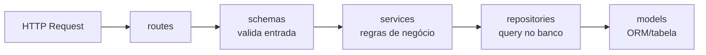

# mvp-DFSB-backend

Repositório para armazenar o backend do MVP de desenvolvimento FullStack Básico.

API REST de To-Do List construída com Flask, seguindo princípios de separação de responsabilidades e arquitetura em camadas.

## Stack

- **Flask** + **flask-openapi3** — framework web e documentação OpenAPI/Swagger
- **SQLAlchemy** — ORM e acesso ao banco de dados
- **Pydantic** — validação de dados e serialização
- **SQLite** — banco de dados (arquivo `todo.db`)

## Como rodar

### Localmente

```bash
pip install -r requirements.txt
flask run --host 0.0.0.0 --port 8080
```

### Docker

Se possuir Docker, poderá rodar em um container:

```bash
# Build da imagem
docker build -t python-backend:1.0.0 .
# Rodar o container
docker run --rm -p 8080:8080 python-backend:1.0.0
```

---

A API sobe em `http://localhost:8080`. A documentação interativa fica disponível em `http://localhost:8080/openapi`.

## Endpoints

| Método | Rota | Descrição |
| ------ | ---- | --------- |
| GET | `/tasks/` | Lista todas as tarefas |
| POST | `/tasks/` | Cria uma nova tarefa |
| GET | `/tasks/<id>` | Retorna uma tarefa pelo ID |
| PATCH | `/tasks/<id>` | Atualiza parcialmente uma tarefa |
| DELETE | `/tasks/<id>` | Remove uma tarefa |
| GET | `/health` | Health check |

## Estrutura do projeto

```text
src/
├── models/        # Camada de dados
├── repositories/  # Camada de acesso ao banco
├── services/      # Camada de negócio
├── schemas/       # Validação e serialização
└── routes/        # Camada HTTP (endpoints)
```

### Responsabilidades de cada camada

**`models/`**
Define as entidades do banco de dados e a configuração da conexão.

- `database.py` — engine, sessão e `Base` do SQLAlchemy; funções `get_db()` e `init_db()`
- `task.py` — modelo ORM da tabela `tasks` (colunas, tipos, constraints)

**`repositories/`**
Único ponto de acesso direto ao banco. Contém operações CRUD puras, sem lógica de negócio.

- `task_repository.py` — `get_all`, `get_by_id`, `create`, `update`, `delete`

**`services/`**
Orquestra as regras de negócio. Usa o repositório para buscar dados e aplica validações (ex: lança `TaskNotFoundError` ao tentar atualizar uma tarefa inexistente).

- `task_service.py` — `list_tasks`, `get_task`, `create_task`, `update_task`, `delete_task`

**`schemas/`**
Modelos Pydantic para validação de entrada e formato de saída. Controla o que é aceito nas requisições e o que é retornado nas respostas.

- `task_schema.py` — `TaskCreateBody`, `TaskUpdateBody`, `TaskResponse`, `TaskListResponse`, `ErrorResponse`

**`routes/`**
Endpoints Flask. Recebe requisições HTTP, aciona o serviço e devolve respostas HTTP. Não contém lógica de negócio.

- `task_routes.py` — blueprint `/tasks` com os cinco endpoints da API

### Fluxo de uma requisição


